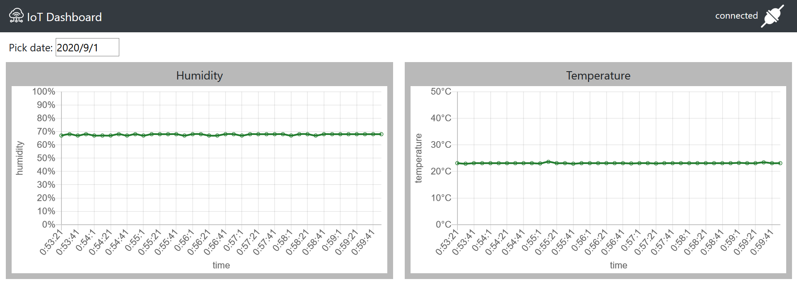
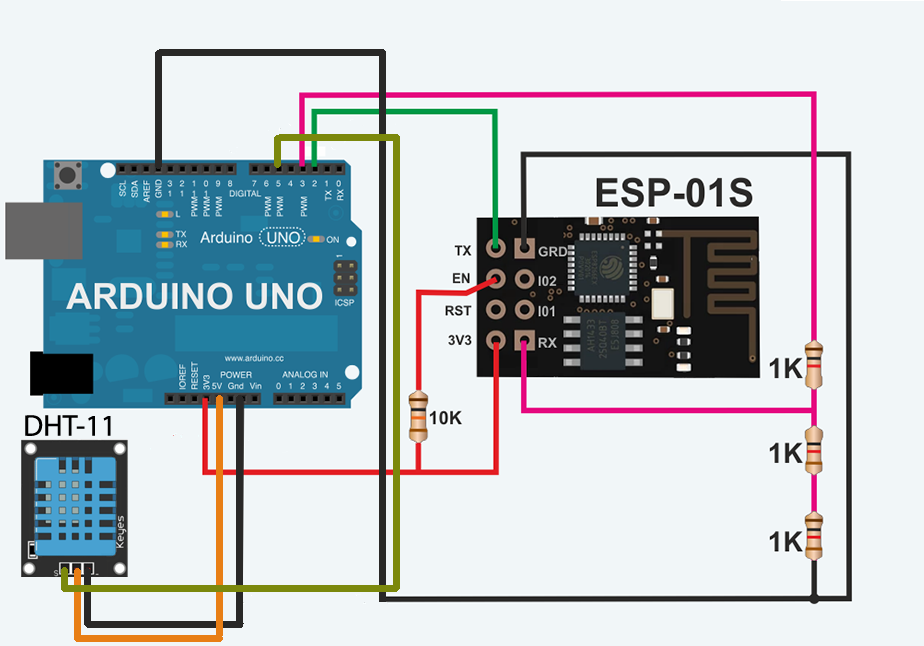
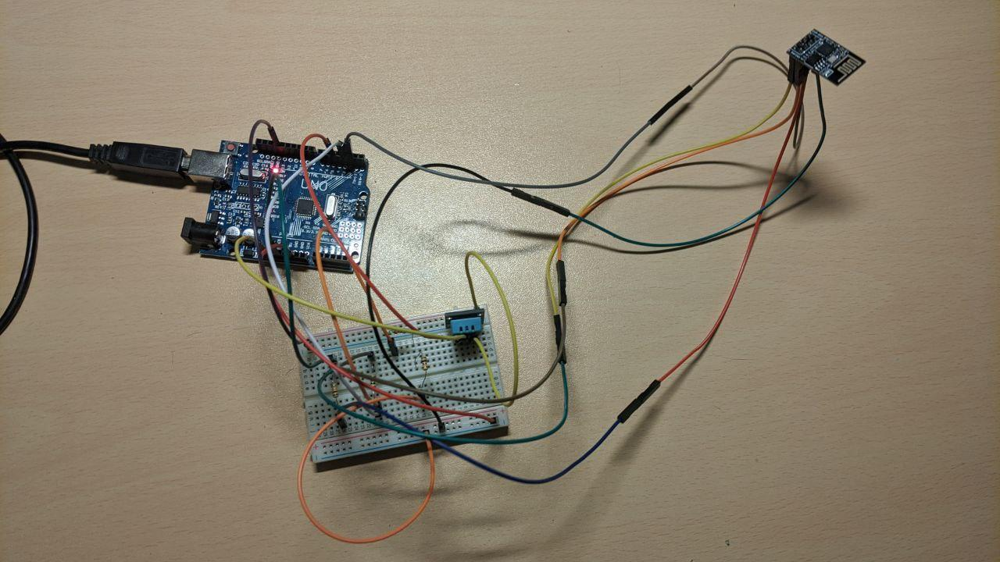

# IoT project
## Description
The project is a realtime dashboard that indicates temperature and humidity got from sensor DHT-11. 



## How to use
The dashboard automatically connects to the NodeJS server at 5000 port and visualizes data at charts on the fly. 

After the new data is read by sensors, it comes to the NodeJS TCP server at 5001 port and after that the server automatically sends updates to all the clients. 

If the client is currently monitoring today's data, the charts will be updated automatically. 

In the right top corner of the dashboard there is an indicator of the connection between client and server.

The only control element here is a datepicker. So you can look at the data, which was read by sensors in the past. If there is no such data, the charts will be cleared and you will see the notifying message "No data found for specified date".

The hardware is an Arduino Uno with esp-01s connected to it. Here is the scheme:



Here is a picture of the real Arduino device



## Requirements to build the hardware device
1. Arduino Uno
2. DHT-11 sensors
3. esp-01s module
4. Wires x11 
5. bread board
6. 1kO resistor x3
7. 10kO resistor x1
8. USB female A

## How to upload Arduino code to the microcontroller
1. Download Arduino Studio
2. In libraries manager download [DHT sensor library](https://www.arduino.cc/reference/en/libraries/dht-sensor-library/)
3. Define your SSID, PASS, IP (ip address of your machine with nodejs server and mongodb instance)
4. Upload scetch to the device connected via USB-B.

## Requirements to set up the server
1. NodeJS installed on your machine
2. MongoDB with empty "iot_dt" db created and empty "iot_sensors" collection in it.

## Setting up the server
Go to the project's directory and execute:
```
npm install
```
Start the HTTP server at 5000 port and TCP server at 5001 port with:
```
npm start
```
Go to localhost:5000 or 127.0.0.1:5000 in your browser. You should see the Dashboard interface


